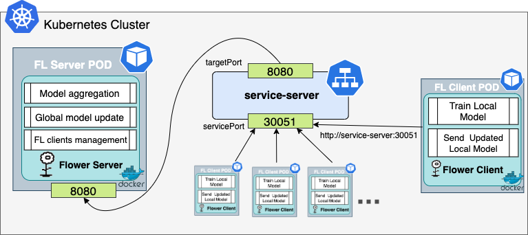

# KubeFlower: Kubernetes-based Federated Learning

## What is KubeFlower?
Kubeflower is a project for exploting the benefits of cloud-native and container-based technologies for the development, deployment and workload management of Federated Learning (FL) pipelines. We use the open-source framework [Flower](https://flower.dev/) for the FL workload control. Flower has been widely adopted in industry and academy. In order increase computation elasticity and efficiency when deploying FL, we use the container orchestration system [Kubernetes](https://kubernetes.io/) (K8s). We use different concepts as FL server, FL clients, K8s clusters, K8s deployments, K8s pods, and K8s services. If you are not familiar with this terminology, please watch the following resources: [Federated Learning](https://youtu.be/nBGQQHPkyNY), [Kubernetes](https://youtu.be/s_o8dwzRlu4). 

## Top-Level Features
* Single and multi-node implementation.
* High availability through clustering and distributed state management.
* Scalability through clustering of network device control.
* CLI for debugging.
* Applicable to real-world scenarios.
* Extandable.
* Cross-platform (Linux, macOS, Windows).

## Getting started

### Dependencies

For this proof-of-concept, a K8s cluster is deployed locally using minikube. The following packages are required and should be installed beforehand:
* [git](https://git-scm.com/)
* [docker](https://www.docker.com/)
* [minikube](https://minikube.sigs.k8s.io/docs/)

### Step-by-step setup
 1. Clone the present repository in the CLI.
 ```bash
    git clone git@github.com:hpn-bristol/kubeFlower.git
 ```
 2. Go to the folder that contains Kubeflower 
 3. Point your terminal to use the docker deamon inside minikube     
 ```bash
    eval $(minikube docker-env)
 ```
 4. Deploy a K8s cluster in minikube.
 ```bash
    minikube start
 ```
 5. Check minikube docker images. 
 ```bash
    minikube image list
 ```
 You will find a list of standard k8s docker images for management. For example, k8s.gcr.io/kube-scheduler, k8s.gcr.io/kube-controller-manager, etc. 
 
 6. Build the docker image from this repo (dockerfile) with the requiered packages (requirements.txt). This image is based on python:3.9.8-slim-bullseye. 
 ```bash
    minikube image build -t kubeflower .
 ```
 where your image will be called `kubeflower` and the building source `.` will be the current folder. 
 
 7. Check your image has been succesfully added to the minikube docker.
    ```bash
    minikube image list
    ```
check that `kubeflower:latest` is in the list, where `latest` is the tag assigend to the docker image by default. 

 ### Step-by-step deployment
 Now you are ready for deploying the FL pipeline using K8s. We will be using K8s deployments to create K8s pods that will use a K8s service for communitacions. Each pod represents a FL actor with a main pod that will act as a FL server. The proposed architecture is depicted in the figure. 

 

 The docker image `kubeflower` is used to deploy the containers with the Flower's pipeline and other dependencies. These containers are deployed in pods. The FL server Pod exposes port 8080 for the gRPC communication implemented by Flower. Instead of using a predefined IP for the server, we use K8s service `ClusterIP` that will allow to locate the FL server pod even if it restarts and change its IP. The service exposes the port 30051 that can be targeted by the FL Client Pods through `http:service-server:30051`. For the FL setup, we use the FL PyTorch implementation of Flower. This simple example can be found [here](https://flower.dev/docs/quickstart-pytorch.html). 

To deploy this architecture you need to:

1. Deploy the `service-server` K8s service. From the root folder run:
    ```bash
    kubectl apply -f descriptors/serverService.yaml
    ```

    We are using ClusterIP but it can be modified with a NodePort or LoadBalancer if specific communications are required.  

2. Deploy the FL server pod through the K8s deployment. 
    ```bash
    kubectl apply -f descriptors/serverDeploy.yaml
    ```
    By default the server will start a run of 5 rounds when 2 clients are available. To change thess values, edit the `serverDeploy.yaml` file. Different values should be passed as argumments in the line ```args: ["python ./src/server.py"]```. Possible values are: --clients, --min, --rounds.   
3. Check the SELECTOR for both the service and deployment. They should match `app=flower-server`.
    ```bash
    kubectl get all -owide
    ```

    
4. Deploy FL clients using the clientDeploy.yaml descriptor.  
    ```bash
    kubectl apply -f descriptors/clientDeploy.yaml
    ```

    By default this descriptor will deploy 2 clients. To increase the number of clients, edit the `replicas: 2` value in the .yaml file. 
5. Monitor the training process. 
    ```bash
    kubectl get all
    ```
    Get the pods IDs.
    
     

    Check the logs on the ```flower-server``` pod.
    ```bash
    kubectl logs flower-server-64f78b8c5c-kwf89 -f
    ```

    Open a new terminal and check the logs on the ```flower-client``` pods. Repeat the process if required for the different clients.
    ```bash
    kubectl logs flower-client-7c69c8c776-cjw6r -f
    ``` 

6. After the FL process has finished, kill the pods and services, and stop the K8s cluster on minikube.
    ```bash
    kubectl delete deploy flower-client flower-server

    kubectl delete service service-server

    minikube stop
    ```

This is a simple implementation of container-based FL using Flower and K8s for orchestration. For further discussions/ideas/projects, please contact the developers.  
